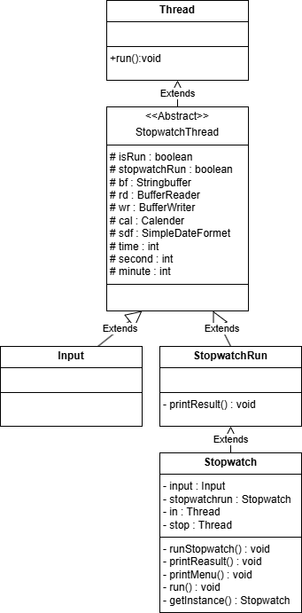
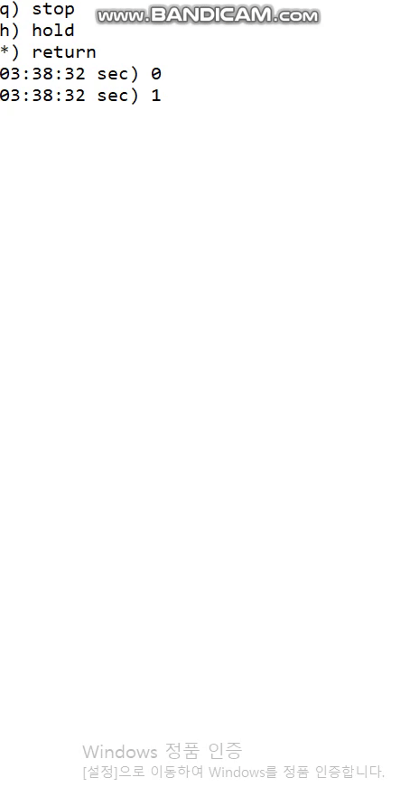

# Stopwatch
-자바로 문자열 가변 배열처리와, 멀티스레딩을 활용한 스탑워치를 구현했습니다..

>#### 프로젝트설명
* 입력과 스탑워치의 멀티스레딩을 구현했다.
  - h(H)를 입력시 스탑워치가 일시정지된다.
  - q(Q)를 입력시 스탑워치가 종료되고, 누적 시간을 출력한다.
  - 두 키를 제외한 아무 키나 입력시 , 스탕워치가 재시작된다.
  - 입력은 버퍼 리더를 사용하면서, 멀티스레드로 스탑워치가 일시 정지 중일때도 받을 수 있다.
>#### Class Diagram

>#### Demo

